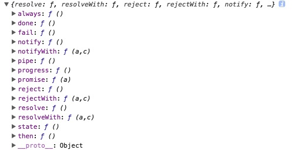

# 搞懂jquery中的Promise

前两篇我们讲了ES6中的Promise以及Promise/A+规范，在Promise的知识体系中，jquery当然是必不可少的一环，所以本篇就来讲讲jquery中的Promise，也就是我们所知道的Deferred对象。

事实上，在此之前网上有很多文章在讲jquery Deferred对象了，但是总喜欢把ajax和Deferred混在一起讲，容易把人搞混。when、done、promise、success、error、fail、then、resolve、reject、always这么多方法不能揉在一起讲，需要把他们捋一捋，哪些是Deferred对象的方法，哪些是ajax的语法糖，我们需要心知肚明。

## 先讲$.Deferred

jquery用`$.Deferred`实现了Promise规范，$.Deferred是个什么玩意呢？还是老方法，打印出来看看，先有个直观印象：

```javascript
var def = $.Deferred();
console.log(def);
```

输出如下：



$.Deferred()返回一个对象，我们可以称之为Deferred对象，上面挂着一些熟悉的方法如：done、fail、then等。jquery就是用这个Deferred对象来注册异步操作的回调函数，修改并传递异步操作的状态。

Deferred对象的基本用法如下，为了不与ajax混淆，我们依旧举setTimeout的例子：

```javascript
function runAsync(){
    var def = $.Deferred();
    //做一些异步操作
    setTimeout(function(){
        console.log('执行完成');
        def.resolve('随便什么数据');
    }, 2000);
    return def;
}
runAsync().then(function(data){
    console.log(data)
});
```

在runAsync函数中，我们首先定义了一个def对象，然后进行一个延时操作，在2秒后调用def.resolve()，最后把def作为函数的返回。调用runAsync的时候将返回def对象，然后我们就可以.then来执行回调函数。

是不是感觉和ES6的Promise很像呢？我们来回忆一下第一篇中ES6的例子：

```javascript
function runAsync(){
    var p = new Promise(function(resolve, reject){
        //做一些异步操作
        setTimeout(function(){
            console.log('执行完成');
            resolve('随便什么数据');
        }, 2000);
    });
    return p;
}
runAsync()
```

区别在何处一看便知。由于jquery的def对象本身就有resolve方法，所以我们在创建def对象的时候并未像ES6这样传入了一个函数参数，是空的。在后面可以直接def.resolve()这样调用。

这样也有一个弊端，因为执行runAsync()可以拿到def对象，而def对象上又有resolve方法，那么岂不是可以在外部就修改def的状态了？比如我把上面的代码修改如下：

```javascript
var d = runAsync();
d.then(function(data){
    console.log(data)
});
d.resolve('在外部结束');
```

现象会如何呢？并不会在2秒后输出“执行完成”，而是直接输出“在外部结束”。因为我们在异步操作执行完成之前，没等他自己resolve，就在外部给resolve了。这显然是有风险的，比如你定义的一个异步操作并指定好回调函数，有可能被别人给提前结束掉，你的回调函数也就不能执行了。

怎么办？jquery提供了一个promise方法，就在def对象上，他可以返回一个受限的Deferred对象，所谓受限就是没有resolve、reject等方法，无法从外部来改变他的状态，用法如下：

```javascript
function runAsync(){
    var def = $.Deferred();
    //做一些异步操作
    setTimeout(function(){
        console.log('执行完成');
        def.resolve('随便什么数据');
    }, 2000);
    return def.promise(); //就在这里调用
}
```

这样返回的对象上就没有resolve方法了，也就无法从外部改变他的状态了。这个promise名字起的有点奇葩，容易让我们搞混，其实他就是一个返回受限Deferred对象的方法，与Promise规范没有任何关系，仅仅是名字叫做promise罢了。虽然名字奇葩，但是推荐使用。

## then的链式调用

既然Deferred也是Promise规范的实现者，那么其他特性也必须是支持的。链式调用的用法如下：

```javascript
var d = runAsync();

d.then(function(data){
    console.log(data);
    return runAsync2();
})
.then(function(data){
    console.log(data);
    return runAsync3();
})
.then(function(data){
    console.log(data);
});
```

与我们第一篇中的例子基本一样，可以参照。

## done与fail

我们知道，Promise规范中，then方法接受两个参数，分别是执行完成和执行失败的回调，而jquery中进行了增强，还可以接受第三个参数，就是在pending状态时的回调，如下：
deferred.then( doneFilter [, failFilter ] [, progressFilter ] )
除此之外，jquery还增加了两个语法糖方法，done和fail，分别用来指定执行完成和执行失败的回调，也就是说这段代码：

```javascript
d.then(function(){
    console.log('执行完成');
}, function(){
    console.log('执行失败');
});
```

与这段代码是等价的：

```javascript
d.done(function(){
    console.log('执行完成');
})
.fail(function(){
    console.log('执行失败');
});
```

## always的用法

jquery的Deferred对象上还有一个always方法，不论执行完成还是执行失败，always都会执行，有点类似ajax中的complete。不赘述了。

## $.when的用法

jquery中，还有一个`$.when`方法来实现Promise，与ES6中的all方法功能一样，并行执行异步操作，在所有的异步操作执行完后才执行回调函数。不过`$.when`并没有定义在`$.Deferred`中，看名字就知道，`$.when`，它是一个单独的方法。与ES6的all的参数稍有区别，它接受的并不是数组，而是多个Deferred对象，如下：

```javascript
$.when(runAsync(), runAsync2(), runAsync3())
.then(function(data1, data2, data3){
    console.log('全部执行完成');
    console.log(data1, data2, data3);
});
```

jquery中没有像ES6中的race方法吗？就是以跑的快的为准的那个方法。对的，jquery中没有。

以上就是jquery中Deferred对象的常用方法了，还有一些其他的方法用的也不多，干脆就不记它了。接下来该说说ajax了。

## ajax与Deferred的关系

jquery的ajax返回一个受限的Deferred对象，还记得受限的Deferred对象吧，也就是没有resolve方法和reject方法，不能从外部改变状态。想想也是，你发一个ajax请求，别人从其他地方给你取消掉了，也是受不了的。

既然是Deferred对象，那么我们上面讲到的所有特性，ajax也都是可以用的。比如链式调用，连续发送多个请求：

```javascript
req1 = function(){
    return $.ajax(/*...*/);
}
req2 = function(){
    return $.ajax(/*...*/);
}
req3 = function(){
    return $.ajax(/*...*/);
}

req1().then(req2).then(req3).done(function(){
    console.log('请求发送完毕');
});
```

明白了ajax返回对象的实质，那我们用起来就得心应手了。

## success、error与complete

这三个方法或许是我们用的最多的，使用起来是这样的：

```javascript
$.ajax(/*...*/)
.success(function(){/*...*/})
.error(function(){/*...*/})
.complete(function(){/*...*/})
```

分别表示ajax请求成功、失败、结束的回调。这三个方法与Deferred又是什么关系呢？其实就是语法糖，success对应done，error对应fail，complete对应always，就这样，只是为了与ajax的参数名字上保持一致而已，更方便大家记忆，看一眼源码：

```javascript
deferred.promise( jqXHR ).complete = completeDeferred.add;
jqXHR.success = jqXHR.done;
jqXHR.error = jqXHR.fail;
```

complete那一行那么写，是为了减少重复代码，其实就是把done和fail又调用一次，与always中的代码一样。deferred.promise( jqXHR )这句也能看出，ajax返回的是受限的Deferred对象。

jquery加了这么些个语法糖，虽然上手门槛更低了，但是却造成了一定程度的混淆。一些人虽然这么写了很久，却一直不知道其中的原理，在面试的时候只能答出一些皮毛，这是很不好的。这也是我写这篇文章的缘由。

jquery中Deferred对象涉及到的方法很多，本文尽量分门别类的来介绍，希望能帮大家理清思路。总结一下就是：`$.Deferred`实现了Promise规范，then、done、fail、always是Deferred对象的方法。`$.when`是一个全局的方法，用来并行运行多个异步任务，与ES6的all是一个功能。ajax返回一个Deferred对象，success、error、complete是ajax提供的语法糖，功能与Deferred对象的done、fail、always一致。