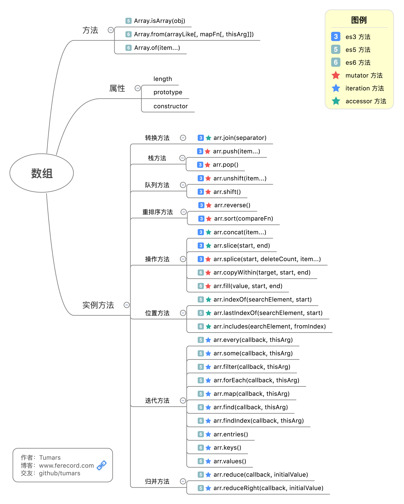

# js数组



访问器（accessor）方法 和 修改器（mutator）方法，迭代、遍历(Iteration) 与 递归(Recursion)

## 属性

### length

length属性表示数组的长度，即其中元素的个数。

JavaScript数组的length属性是可变的，当length属性被设置得更大时，整个数组的状态事实上不会发生变化，仅仅是length属性变大；当length属性被设置得比原来小时，则原先数组中索引大于或等于length的元素的值全部被丢失。

### prototype

返回对象类型原型的引用。prototype 属性是 object 共有的。

一般用来给数组实例添加方法。

### constructor

表示创建对象的函数。

说明：constructor 属性是所有具有 prototype 的对象的成员。constructor 属性保存了对构造特定对象实例的函数的引用。

## 数组方法

### Array.isArray()

检测对象是否 Array ，是则返回true，否则为false。

### Array.from(arrayLike, mapFn, thisArg)

该方法从一个类似数组或可迭代对象创建一个新的数组实例。参数 arrayLike 是想要转换成真实数组的类数组对象或可遍历对象。mapFn 是可选参数，如果指定了该参数，则最后生成的数组会经过该函数的加工处理后再返回。thisArg是可选参数，为执行 mapFn 函数时 this 的值。

<font color="B13943">所谓类似数组的对象，本质特征只有一点，即必须有length属性。</font>因此，任何有length属性的对象，都可以通过Array.from方法转为数组。

实际应用中，常见的类似数组的对象是 DOM 操作返回的 NodeList 集合，以及函数内部的 arguments 对象。

### Array.of(item…)

该方法用于创建数组实例。该方法用于替代 Array() 或 new Array()。Array.of() 和 Array 构造函数之间的区别在于处理整数参数：Array.of(7) 创建一个具有单个元素 7 的数组，而 Array(7) 创建一个包含 7 个 undefined 元素的数组。

```javascript
Array.of(7);       // [7]
Array.of(1, 2, 3); // [1, 2, 3]
Array(7);          // [ , , , , , , ]
Array(1, 2, 3);    // [1, 2, 3]

Array.of(7);       // [7]
Array.of(1, 2, 3); // [1, 2, 3]

Array(7);          // [ , , , , , , ]
Array(1, 2, 3);    // [1, 2, 3]
```

## 数组实例方法

### 转换方法 join

>arr.join(separator)

把数组构构造成字符串，它先把数组中的每个元素转换成字符串，然后再用 separator 分隔符把它们链接在一起，separator 分隔符默认是逗号 “,”，要想做到无间隔链接，可以使用空字符串作为 separator：

```javascript
var arr = [1,2,3,4,5]
arr.join('|') //"1|2|3|4|5"
arr.join("") //12345

//另所有对象有具有的 toLocaleString、toString、valueOf，可以看作是join的特殊用法，不常用
```

### 栈方法 push, pop

>arr.push(item…)

将一个或多个新元素添加到数组结尾，并返回数组新长度。

>arr.pop()

移除最后一个元素并返回该元素值。

### 队列方法 unshift, shift

>arr.unshift(item…)

将一个或多个新元素添加到数组开始，数组中的元素自动后移，返回数组新长度。

>arr.shift()

移除最前一个元素并返回该元素值，数组中元素自动前移.如果这个数组是空的，它会返回 undefined。<font color="B13943">shift 通常比 pop 慢的多。</font>

### 重排序方法 reverse, sort

>arr.reverse()

反转数组的顺序。

>arr.sort(comparefn)

给数组排序，默认升序。

>注意 sort 默认会将数组内容视为字符串来排序，所以对数字排序时默认的排序规则会错的离谱。一般我们给sort带入个比较函数来替代原来的默认的比较方法，比较方法接受两个参数，如果两个参数相等则返回0，如果第一个参数应该排在前面则返回一个负数，如果第二个参数应该排在前面则返回一个正数：

```JavaScript
// 数组排序
var arr = [2,3,1,5,4]
arr.sort(function(a, b) {
return a - b
}) // [1,2,3,4,5]

// 数组排序
var arr = [2,3,1,5,4]
arr.sort(function(a, b) {
    return b - a
}) // [1,2,3,4,5]
```

### 操作方法

>concat, slice, splice, copyWithin, fill

#### arr.concat(item…)

该方法产生一份 arr 的潜复制，并将多个数组（也可以是字符串，或者是数组和字符串的混合）附加在其后连接为一个数组，返回连接好的新的数组。

#### arr.slice(start, end)

该方法对数组中的一段做浅复制，首先复制数组 arr[start] 至 arr[end] 的部分，注意不包括 end 对应的元素，如果省略 end 将复制 start 之后的所有元素（或者理解成 end 的默认值为 arr.length）。字符串也有个同名方法 string.slice。

#### arr.splice(start, deleteCount, item…)

该方法从 arr 中移除一个或多个元素，并将新的 item 插入至移除元素的开始位置， 参数 start 是移除元素的开始位置，deleteCount 是要移除的元素的个数，item 是要被插入的元素。它返回一个包含被移除元素的数组。

#### arr.copyWithin(target, start, end)

该方法复制数组的一部分到同一数组中的另一个位置（会覆盖原成员），并返回修改后的数组。使用这个方法，会修改当前数组。参数 target 为开始替换数据的位置，若 target 大于等于 arr.length，将会不发生拷贝。start 是可选参数，为开始读取数据的位置，默认为0。end 是可选参数，为停止读取数据的位置，默认为 arr.length。

```javascript
[1, 2, 3, 4, 5].copyWithin(0, 3)
// [4, 5, 3, 4, 5]

[1, 2, 3, 4, 5].copyWithin(0, 3)
// [4, 5, 3, 4, 5]
```

上面代码表示将从3号位直到数组结束的成员（4和5），复制到从0号位开始的位置，结果覆盖了原来的1和2。

#### arr.fill(value, start, end)

该方法使用给定值填充一个数组，参数 value 是用来填充数组的值。start 是可选参数，为填充开始位置，默认为 0。end 是可选参数，为填充的结束位置，默认为 arr.length。

```javascript
[1, 2, 3].fill(4)            // [4, 4, 4]
[1, 2, 3].fill(4, 1 , 2)            // [1, 4, 3]
[1, 2, 3].fill(4)            // [4, 4, 4]
[1, 2, 3].fill(4, 1 , 2)            // [1, 4, 3]
```

fill 方法是个可变方法, 它会改变调用它的 this 对象本身, 然后返回它, 而并不是返回一个副本。

### 位置方法

>indexOf, lastIndexOf, includes

#### arr.indexOf(searchElement, start)

该方法返回要查找的项在数组中的位置，如果没找到返回 -1。接受两个参数，searchElement 是要查找的项，start 是查找起始位置的索引，默认是0。

arr.lastIndexOf(searchElement, start)
从 start 位置开始向前查找，start 默认值为 arr.length – 1。

注意该方法在比较查找项与数组中每一项时，会使用全等操作符，也就是要求查找的项必须严格相等。

arr.includes(searchElement, fromIndex)
该方法用来判断当前数组是否包含某指定的值，如果是，则返回 true，否则返回 false。参数 searchElement 为需要查找的元素值。参数 fromIndex 是可选参数，从该索引处开始查找 searchElement，如果为负值，则按升序从 array.length + fromIndex 的索引开始搜索，默认为 0。 如果fromIndex 大于等于数组长度 ，则返回 false 。该数组不会被搜索。
该方法属于ES7，但Babel转码器已经支持。

```javascript
[1, 2, 3].includes(2);     // true
[1, 2, 3].includes(4);     // false
[1, 2, NaN].includes(NaN); // true
[1, 2, 3].includes(2);     // true
[1, 2, 3].includes(4);     // false
[1, 2, NaN].includes(NaN); // true
```

没有该方法之前，我们通常使用数组的indexOf方法，检查是否包含某个值。

```javascript
if (arr.indexOf(el) !== -1) {
// ...
}

if (arr.indexOf(el) !== -1) {
  // ...
}
```

indexOf方法有两个缺点，一是不够语义化，它的含义是找到参数值的第一个出现位置，所以要去比较是否不等于-1，表达起来不够直观。二是，它内部使用严格相当运算符（===）进行判断，这会导致对NaN的误判。includes使用的是不一样的判断算法，就没有这个问题。

```javascript
console.log([NaN].indexOf(NaN)); // -1
console.log([NaN].includes(NaN)); // false
```

### 迭代方法

>every, some, filter, forEach, map, find, findIndex, entries, keys, values

#### arr.every(callback，thisArg)

对数组中的每一项运行给定函数，如果该函数对每一项都返回 true，则返回 true。callback 被调用时传入三个参数：元素值，元素的索引，原数组。thisArg 为可选参数，指定执行 callback 时使用的 this 值。

#### arr.some(callback, thisArg)

对数组中的每一项运行给定函数，如果该函数对任意一项返回 true，则返回 true。

#### arr.filter(callback, thisArg)

对数组中的每一项运行给定函数，返回该函数会返回 true 的项组成的数组。

#### arr.forEach(callback)

对数组中的每一项运行给定函数，这个方法没有返回值。本质上与使用 for 循环迭代数组一样。

#### arr.map(callback)

对数组中的每一项运行给定函数，返回每次函数调用组成的数组。

#### arr.find(callback, thisArg)

该方法对数组所有成员依次执行 callback 函数，直到找出第一个返回值为 true 的成员，然后返回该成员。如果没有符合条件的成员，则返回 undefined。

```JavaScript
[1, 4, -5, 10].find((v, i, arr) => v < 0)
// -5

[1, 4, -5, 10].find((v, i, arr) => v < 0)
// -5
```

find方法的回调函数可以接受三个参数，依次为当前的值、当前的位置和原数组

arr.findIndex(callback, thisArg)
该方法与 arr.find() 类似，对数组中的成员依次执行 callback 函数，直至照吃第一个返回值为 true 的成员，然后返回该成员的索引。如果没有符合条件的成员，则返回 -1。

```javascript
[1, 5, 10, 15].findIndex((v, i , arr)=>{
    return v > 9
})
//2
```

#### arr.entries() 、arr.keys()、 arr.values()

这三个方法都返回一个新的Array Iterator对象，可以用for...of循环进行遍历，区别是keys()是对键名的遍历、values()是对键值的遍历，entries()是对键值对的遍历。

```javascript
for (let index of ['a', 'b'].keys()) { console.log(index); }
// 0
// 1

for (let elem of ['a', 'b'].values()) { console.log(elem) ;}
// 'a'
// 'b'

for (let [index, elem] of ['a', 'b'].entries()) { console.log(index, elem);}
// 0 "a"
// 1 "b"

var arr = ["a", "b"];
var iterator = arr.entries(); // undefined

console.log(iterator); // Array Iterator {}

console.log(iterator.next().value);  // [0, "a"]
console.log(iterator.next().value);  // [1, "b"]
```

### 归并方法

>reduce, reduceRight

```javascript
arr.reduce(callback, initialValue)
arr.reduceRight(callback, initialValue)
```

这个两个方法都会迭代数组所有的项，然后返回一个最终值。reduce()方法从数组的第一项开始，逐个遍历到最后，而reduceRight()则从数组的最后一项开始，向前遍历到第一项。它们接受两个参数，callback 每一项上调用的函数，callback 被调用时传入四个参数：上一次调用回调返回的值、正在处理的元素、正在处理的元素的索引值（如果提供了 initialValue ，从0开始；否则从1开始）、原数组。initialValue 是可选项，作为归并基础的初始值，其值用于第一次调用 callback 的第一个参数。

## 数组常见练习

### 数组合并

#### 多个一维数组合并

如有两个一维数组，要将他们合并成一个数组:

```javascript
var arr1 = [1, 2]
var arr2 = [3, 4]
// => [1,2,3,4]
```

##### Array.prototype.concat()方法

```javascript
var arr = arr1.concat(arr2) //[1, 2, 3, 4]
```

##### for循环和Array.prototype.push()

```javascript
function flation(arr1, arr2) {
    for (var i = 0; i < arr2.length; i++) {
        arr1.push(arr2[i])
    }
    return arr1
}
```

##### reduce()或reduceRight()方法

```javascript
function flatten(arr1, arr2) {
    return arr2.reduce(function (prev, curr) {
        prev.push(curr);
        return prev;
    }, arr1)
}
```

#### 多维（复合）数组合并成一维数组

例如有这么一组多维数组，要把它拍平成1维数组：

```JavaScript
var myArray = [[1, 2], [3, 4, 5], [6, 7, 8, 9], [11,12,[12,13,[14]]], 10, 11];
// => [1, 2, 3, 4, 5, 6, 7, 8, 9, 11, 12, 12, 13, 14, 10, 11]
```

##### Array.prototype.push()方法

```javascript
function flatten(arr, result) {
    if (!result) {
        result = []
    }
    for (var i = 0; i < arr.length; i++) {
        if(arr[i].constructor == Array) {
            flatten(arr[i], result)
        } else {
            result.push(arr[i])
        }
    }
    return result
}

flatten([[1, 2], [3, 4, 5], [6, 7, 8, 9], [11,12,[12,13,[14]]], 10, 11])
//[1, 2, 3, 4, 5, 6, 7, 8, 9, 11, 12, 12, 13, 14, 10, 11]
```

##### Array.prototype.concat()方法

```Javascript
//省略对二维以上数组的判断
function flatten(arr) {
    var result = [];
    for (var i = 0; i < arr.length; i++) {
        result = result.concat(arr[i])
    }
    return result
}
flatten([[1, 2],[3, 4, 5], [6, 7, 8, 9]]);//[1, 2, 3, 4, 5, 6, 7, 8, 9]
flatten([[1, 2],[3, 4, 5], [6, 7, 8, 9],10,11]);//[1, 2, 3, 4, 5, 6, 7, 8, 9, 10, 11]
```

##### Function.prototype.apply()方法

让其变得更简单

```JavaScript
//省略对二维以上数组的判断
function flatten(arr) {
    return Array.prototype.concat.apply([], arr)
}
```

### 数组去重

```javascript
function unique(arr) {
    var result = [arr[0]]
    arr.forEach(function(v) {
        if (result.indexOf(v) == -1) {  //这里 indexOf()也可替换为es7的includes()
            result.push(v)
        }
    })
    return result
}
unique([1, 2, 3, 4, 3, 2, 'a', 'b', 'a']);
//[1, 2, 3, 4, "a", "b"]
```