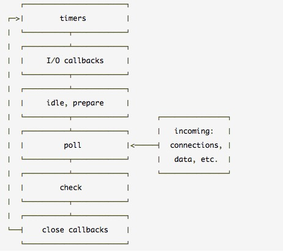

# 不要混淆nodejs和浏览器中的event loop

## 不同的event loop

event loop是一个执行模型，在不同的地方有不同的实现。浏览器和nodejs基于不同的技术实现了各自的event loop。网上关于它的介绍多如牛毛，但大多数是基于浏览器的，真正讲nodejs的event loop的并没有多少，甚至很多将浏览器和nodejs的event loop等同起来的。  我觉得讨论event loop要做到以下两点：

- 首先要确定好上下文，nodejs和浏览器的event loop是两个有明确区分的事物，不能混为一谈。
- 其次，讨论一些js异步代码的执行顺序时候，要基于node的源码而不是自己的臆想。

简单来讲，

nodejs的event是基于libuv，而浏览器的event loop则在html5的规范中明确定义。
libuv已经对event loop作出了实现，而html5规范中只是定义了浏览器中event loop的模型，具体实现留给了浏览器厂商。

## nodejs中的event loop

关于nodejs中的event loop有两个地方可以参考，一个是nodejs官方的文档；另一个是libuv的[官方的文档](http://docs.libuv.org/en/v1.x/design.html)，前者已经对nodejs有一个比较完整的描述，而后者则有更多细节的描述。nodejs正在快速发展，源码变化很大，以下的讨论都是基于nodejs9.5.0。

（然而nodejs的event loop似乎比预料更加复杂，在查看nodejs源码的过程中我惊奇发现原来nodejs的event loop的某些阶段，还会将v8的micro task queue中的任务取出来运行，看来nodejs的浏览器的event loop还是存在一些关联，这些细节我们往后再讨论，目前先关注重点内容。）

## event loop的6个阶段（phase）

nodejs的event loop分为6个阶段，每个阶段的作用如下（process.nextTick()在6个阶段结束的时候都会执行，文章后半部分会详细分析process.nextTick()的回调是怎么引进event loop，仅仅从uv_run()是找不到process.nextTick()是如何牵涉进来）：

- timers：执行setTimeout() 和 setInterval()中到期的callback。
- I/O callbacks：上一轮循环中有少数的I/Ocallback会被延迟到这一轮的这一阶段执行
- idle, prepare：仅内部使用
- poll：最为重要的阶段，执行I/O callback，在适当的条件下会阻塞在这个阶段
- check：执行setImmediate的callback
- close callbacks：执行close事件的callback，例如socket.on("close",func)



event loop的每一次循环都需要依次经过上述的阶段。  每个阶段都有自己的callback队列，每当进入某个阶段，都会从所属的队列中取出callback来执行，当队列为空或者被执行callback的数量达到系统的最大数量时，进入下一阶段。这六个阶段都执行完毕称为一轮循环。

event loop的核心代码在deps/uv/src/unix/core.c

```c++
int uv_run(uv_loop_t* loop, uv_run_mode mode) {
  int timeout;
  int r;
  int ran_pending;

  /*
  从uv__loop_alive中我们知道event loop继续的条件是以下三者之一：
  1，有活跃的handles（libuv定义handle就是一些long-lived objects，例如tcp server这样）
  2，有活跃的request
  3，loop中的closing_handles
  */
  r = uv__loop_alive(loop);
  if (!r)
    uv__update_time(loop);

  while (r != 0 && loop->stop_flag == 0) {
    uv__update_time(loop);//更新时间变量，这个变量在uv__run_timers中会用到
    uv__run_timers(loop);//timers阶段
    ran_pending = uv__run_pending(loop);//从libuv的文档中可知，这个其实就是I/O callback阶段,ran_pending指示队列是否为空
    uv__run_idle(loop);//idle阶段
    uv__run_prepare(loop);//prepare阶段

    timeout = 0;

    /**
    设置poll阶段的超时时间，以下几种情况下超时会被设为0，这意味着此时poll阶段不会被阻塞，在下面的poll阶段我们还会详细讨论这个
    1，stop_flag不为0
    2，没有活跃的handles和request
    3，idle、I/O callback、close阶段的handle队列不为空
    否则，设为timer阶段的callback队列中，距离当前时间最近的那个
    **/

    if ((mode == UV_RUN_ONCE && !ran_pending) || mode == UV_RUN_DEFAULT)
      timeout = uv_backend_timeout(loop);

    uv__io_poll(loop, timeout);//poll阶段
    uv__run_check(loop);//check阶段
    uv__run_closing_handles(loop);//close阶段
    //如果mode == UV_RUN_ONCE（意味着流程继续向前）时，在所有阶段结束后还会检查一次timers，这个的逻辑的原因不太明确

    if (mode == UV_RUN_ONCE) {
      uv__update_time(loop);
      uv__run_timers(loop);
    }

    r = uv__loop_alive(loop);
    if (mode == UV_RUN_ONCE || mode == UV_RUN_NOWAIT)
      break;
  }

  if (loop->stop_flag != 0)
    loop->stop_flag = 0;

  return r;
}
```

我对重要部分加上注释，从上述代码可以看到event loop的六个阶段是依次执行的。值得注意的是，在UV_RUN_ONCE模式下，timers阶段在当前循环结束前还会得到一次的执行机会。

### timers阶段

timer阶段的代码在deps/uv/src/unix/timer.c的uv__run_timers()中

```java
void uv__run_timers(uv_loop_t* loop) {
  struct heap_node* heap_node;
  uv_timer_t* handle;

  for (;;) {
    heap_node = heap_min((struct heap*) &loop->timer_heap);//取出timer堆上超时时间最小的元素
    if (heap_node == NULL)
      break;
    //根据上面的元素，计算出handle的地址，head_node结构体和container_of的结合非常巧妙，值得学习
    handle = container_of(heap_node, uv_timer_t, heap_node);
    if (handle->timeout > loop->time)//如果最小的超时时间比循环运行的时间还要大，则表示没有到期的callback需要执行，此时退出timer阶段
      break;

    uv_timer_stop(handle);//将这个handle移除
    uv_timer_again(handle);//如果handle是repeat类型的，重新插入堆里
    handle->timer_cb(handle);//执行handle上的callback
  }
}
```

从上面的逻辑可知，在timer阶段其实使用一个最小堆而不是队列来保存所有元素（其实也可以理解，因为timeout的callback是按照超时时间的顺序来调用的，并不是先进先出的队列逻辑），然后循环取出所有到期的callback执行。

### I/O callbacks阶段

I/O callbacks阶段的代码在deps/uv/src/unix/core.c的int uv__run_pending()中

```java
static int uv__run_pending(uv_loop_t* loop) {
  QUEUE* q;
  QUEUE pq;
  uv__io_t* w;

  if (QUEUE_EMPTY(&loop->pending_queue))//如果队列为空则退出
    return 0;

  QUEUE_MOVE(&loop->pending_queue, &pq);//移动该队列

  while (!QUEUE_EMPTY(&pq)) {
    q = QUEUE_HEAD(&pq);//取出队列的头结点
    QUEUE_REMOVE(q);//将其移出队列
    QUEUE_INIT(q);//不再引用原来队列的元素
    w = QUEUE_DATA(q, uv__io_t, pending_queue);
    w->cb(loop, w, POLLOUT);//执行callbak直到队列为空
  }
  return 1;
}
```

根据libuv的文档，一些应该在上轮循环poll阶段执行的callback，因为某些原因不能执行，就会被延迟到这一轮的循环的I/O callbacks阶段执行。换句话说这个阶段执行的callbacks是上轮残留的。

### idle和prepare阶段

uv__run_idle()、uv__run_prepare()、uv__run_check()定义在文件deps/uv/src/unix/loop-watcher.c中，它们的逻辑非常相似，其中的实现利用了大量的宏（说实在我个人非常烦宏，它的可读性真的很差，为了那点点的性能而使用宏真是值得商榷）。

```java
  void uv__run_##name(uv_loop_t* loop) {                                      \
    uv_##name##_t* h;                                                         \
    QUEUE queue;                                                              \
    QUEUE* q;                                                                 \
    QUEUE_MOVE(&loop->name##_handles, &queue);//用新的头节点取代旧的头节点，相当于将原队列移动到新队列                                \
    while (!QUEUE_EMPTY(&queue)) {//当新队列不为空                                            \
      q = QUEUE_HEAD(&queue);//取出新队列首元素                                                 \
      h = QUEUE_DATA(q, uv_##name##_t, queue);//获取首元素中指向的handle                                \
      QUEUE_REMOVE(q);//将这个元素移出新队列                                                        \
      QUEUE_INSERT_TAIL(&loop->name##_handles, q);//然后再插入旧队列尾部                            \
      h->name##_cb(h);//执行对应的callback                                                        \
    }                                                                         \
  }
```

### poll阶段

poll阶段的代码+注释高达200行不好逐行分析，我们挑选部分重要代码

```java
void uv__io_poll(uv_loop_t* loop, int timeout) {
//...
//处理观察者队列
while (!QUEUE_EMPTY(&loop->watcher_queue)) {
//...
if (w->events == 0)
  op = UV__EPOLL_CTL_ADD;//新增监听这个事件
else
  op = UV__EPOLL_CTL_MOD;//修改这个事件
}
//...
//阻塞直到监听的事件来临，前面已经算好timeout以防uv_loop一直阻塞下去
if (no_epoll_wait != 0 || (sigmask != 0 && no_epoll_pwait == 0)) {
   nfds = uv__epoll_pwait(loop->backend_fd,
            events,
            ARRAY_SIZE(events),
            timeout,
            sigmask);
   if (nfds == -1 && errno == ENOSYS)
       no_epoll_pwait = 1;
} else {
    nfds = uv__epoll_wait(loop->backend_fd,
           events,
           ARRAY_SIZE(events),
           timeout);
    if (nfds == -1 && errno == ENOSYS)
    no_epoll_wait = 1;
}
//...
for (i = 0; i < nfds; i++) {
    if (w == &loop->signal_io_watcher)
      have_signals = 1;
    else
      w->cb(loop, w, pe->events);//执行callback
}
//...
}
```

可见poll阶段的任务就是阻塞等待监听的事件来临，然后执行对应的callback，其中阻塞是带有超时时间的，以下几种情况都会使得超时时间为0

- uv_run处于UV_RUN_NOWAIT模式下
- uv_stop()被调用
- 没有活跃的handles和request
- 有活跃的idle handles
- 有等待关闭的handles 如果上述都不符合，则超时时间为距离现在最近的timer；如果没有timer则- poll阶段会一直阻塞下去

### check阶段

见上面的 idle和prepare阶段

### close阶段

```java
static void uv__run_closing_handles(uv_loop_t* loop) {
  uv_handle_t* p;
  uv_handle_t* q;

  p = loop->closing_handles;
  loop->closing_handles = NULL;

  while (p) {
    q = p->next_closing;
    uv__finish_close(p);
    p = q;
  }
}
```

这段代码非常浅显，就是循环关闭所有的closing handles，无需多言。其中的callback调用在uv__finish_close()中

## process.nextTick在哪里

文档中提到process.nextTick()不属于上面的任何一个phase，它在每个phase结束的时候都会运行。但是我们看到uv_run()中只是依次运行了6个phase的函数，并没有process.nextTick()影子，那它是怎么被驱动起来的呢？

这个问题要从两个c++和js的源码层面来说明。

### process.nextTick在js层面的实现

```java
process.nextTick的实现在next_tick.js中

  function nextTick(callback) {
    if (typeof callback !== 'function')
      throw new errors.TypeError('ERR_INVALID_CALLBACK');

    if (process._exiting)
      return;

    var args;
    switch (arguments.length) {
      case 1: break;
      case 2: args = [arguments[1]]; break;
      case 3: args = [arguments[1], arguments[2]]; break;
      case 4: args = [arguments[1], arguments[2], arguments[3]]; break;
      default:
        args = new Array(arguments.length - 1);
        for (var i = 1; i < arguments.length; i++)
          args[i - 1] = arguments[i];
    }

    push(new TickObject(callback, args, getDefaultTriggerAsyncId()));//将callback封装为一个对象放入队列中
  }
```

它并没有什么魔法，也没有调用C++提供的函数，只是简单地将所有回调封装为对象并放入队列。而callback的执行是在函数_tickCallback()

```java
  function _tickCallback() {
    let tock;
    do {
      while (tock = shift()) {
        const asyncId = tock[async_id_symbol];
        emitBefore(asyncId, tock[trigger_async_id_symbol]);
        if (destroyHooksExist())
          emitDestroy(asyncId);

        const callback = tock.callback;
        if (tock.args === undefined)
          callback();//执行调用process.nextTick()时放置进来的callback
        else
          Reflect.apply(callback, undefined, tock.args);//执行调用process.nextTick()时放置进来的callback

        emitAfter(asyncId);
      }
      runMicrotasks();//microtasks将会在此时执行，例如Promise
    } while (head.top !== head.bottom || emitPromiseRejectionWarnings());
    tickInfo[kHasPromiseRejections] = 0;
  }
```

可以看到_tickCallback()会循环执行队列中所有callback，值得注意的是microtasks的执行时机， 因此_tickCallback()的执行就意味着process.nextTick()的回调的执行。我们继续搜索一下发现_tickCallback()在好几个地方都有被调用，但是我们只关注跟event loop相关的。

在next_tick.js中发现

```javascript
const [
    tickInfo,
    runMicrotasks
] = process._setupNextTick(_tickCallback);
```

查找了一下发现在node.cc中有

```c++
env->SetMethod(process, "_setupNextTick", SetupNextTick);//暴露_setupNextTick给js
```

_setupNextTick()是node.cc那边暴露出来的方法，因此猜测这就是连接event loop的桥梁。

## c++中执行process.nextTick的回调

在node.cc中找出SetupNextTick()函数，有这样的代码片段

```c++
void SetupNextTick(const FunctionCallbackInfo<Value>& args) {
  Environment* env = Environment::GetCurrent(args);

  CHECK(args[0]->IsFunction());
  //把js中提供的回调函数（即_tickCallback）保存起来，以供调用
  env->set_tick_callback_function(args[0].As<Function>());
  ...
}
_tickCallback被放置到env里面去了，那它何时被调用？也是在node.cc中我们发现

void InternalCallbackScope::Close() {
  if (!tick_info->has_scheduled()) {
    env_->isolate()->RunMicrotasks();
  }
  //...
  //终于调用在SetupNextTick()中放置进来的函数了
  if (env_->tick_callback_function()->Call(process, 0, nullptr).IsEmpty()) {
    env_->tick_info()->set_has_thrown(true);
    failed_ = true;
  }
}
```

可知InternalCallbackScope::Close()会调用它，而InternalCallbackScope::Close()则在文件node.cc的InternalMakeCallback()中被调用

```c++
MaybeLocal<Value> InternalMakeCallback(Environment* env,
                                       Local<Object> recv,
                                       const Local<Function> callback,
                                       int argc,
                                       Local<Value> argv[],
                                       async_context asyncContext) {
  CHECK(!recv.IsEmpty());
  InternalCallbackScope scope(env, recv, asyncContext);
  //...
  scope.Close();//Close会调用_tickCall
  //...
}
```

而InternalMakeCallback()则是在async_wrap.cc的AsyncWrap::MakeCallback()中被调用

```c++
MaybeLocal<Value> AsyncWrap::MakeCallback(const Local<Function> cb,
                                          int argc,
                                          Local<Value>* argv) {
  //cb就是在event loop的6个phase中执行的回调函数
  MaybeLocal<Value> ret = InternalMakeCallback(env(), object(), cb, argc, argv, context);
}
```

AsyncWrap类是异步操作的封装，它是一个顶级的类，TimerWrap、TcpWrap等封装异步的类都继承了它，这意味着这些类封装异步操作的时候都会调用MakeCallback()。至此真相大白了，uv_run()中的回调都是经过AsyncWrap::MakeCallback()包装过的，因此回调执行完毕之后都会执行process.nextTick()的回调了，与文档的描述是相符合的。整理一下_tickCallback()的转移并最终被调用的流程

## 在js层面

```javascript
_tickCallback()//js中执行process.nextTick()的回调函数
        ↓
process._setupNextTick(_tickCallback) //c++和js的桥梁，将回调交给C++执行
```

此时_tickCallback()被转移到在C++层面，它首先被存储到env中

```javascript
env->set_tick_callback_function()//将_tickCallback存储到env中
        ↓
env->SetMethod(process, "_setupNextTick", SetupNextTick);//调用上者，js中process._setupNextTick的真身
```

被存储到env的_tickCallback()被调用流程如下：

```javascript
env_->tick_callback_function()//取出_tickCallback执行
        ↓
InternalCallbackScope::Close()//调用前者
        ↓
InternalMakeCallback()//调用前者
        ↓
AsyncWrap::MakeCallback()//调用前者
        ↓
被多个封装异步操作的类继承并调用
        ↓
被uv_run()执行，从而实现在每个phase之后调用process.nextTick提供的回调
```

整个过程分析得比较粗糙，后面其实很多细节没去寻找，不过大家可以从以下的参考资料补全其它细节。例如timer的整个执行流程可以看p
[《从./lib/timers.js来看timers相关API底层实现》](https://github.com/xtx1130/blog/issues/15)，是对我没提及地方的一个良好补充。

[https://cnodejs.org/topic/5a9108d78d6e16e56bb80882#5a98d9a2ce1c90bc44c445af](https://cnodejs.org/topic/5a9108d78d6e16e56bb80882#5a98d9a2ce1c90bc44c445af)